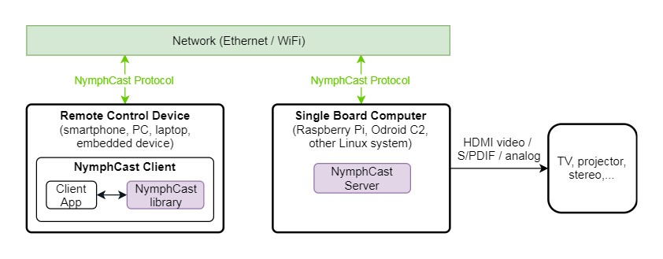

# NymphCast #

NymphCast is a software solution which turns your choice of Linux-capable hardware into an audio and video source for a television or powered speakers. It enables the streaming of audio and video over the network from a wide range of client devices, as well as the casting of streaming media URLs from client devices to a NymphCast server.

In addition it supports powerful apps (NymphCast apps) written in AngelScript to extend the functionality of NymphCast with a variety of online services. 

## Goals ##

- [x] Server (receiver) should be usable on mainstream Linux-capable Single-Board Computer (SBC), including Raspberry Pi and derivatives.

- [x] Casting of local media to a NymphCast server.

- [x] Casting of URLs, for streaming by the server without client interaction.

- [ ] Casting of commands, to control volume, open and control NymphCast apps.

## Quick Start ##

This quick start guide assumes building the receiver (**server**) project on a system (like a Raspberry Pi) running a current version of Debian (Buster) or equivalent. The **player** application can be built on Linux/BSD/MacOS with a current GCC toolchain, or MSYS2 on Windows with MinGW toolchain. 

**Server**

Here two options are possible:

1. Run the `setup.sh` script in the project root to perform the below tasks automatically.

Or:

1. Install the needed dependencies: `sudo apt -y install libsdl2-image-dev libsdl2-dev libpoco-dev` and `sudo apt -y install libswscale-dev libavcodec-dev libavdevice-dev libavformat-dev libavutil-dev libpostproc-dev libswresample-dev`
2. Check-out [NymphRPC](https://github.com/MayaPosch/NymphRPC) elsewhere and build the library with `make lib`.
3. Copy the NymphRPC library from `NymphRPC/lib/` to `/usr/local/lib`.
4. Create `/usr/local/include/nymph` folder. Perform `sudo cp src/*.h /usr/local/include/nymph`.
5. Change to `NymphCast/src/server` and execute `make` command.
6. The server binary is found under `bin/`. Copy the *.jpg images into the bin folder for the screensaver feature.
7. Copy the `nymphcast_config.ini` file into `bin/` as well.
8. Copy the `apps/` folder into the `bin/`' folder.
9. Simply execute the binary to have it start listening on port 4004: `./nymphcast_server -c nymphcast_config.ini`.

**Player**

1. Build the libnymphcast library in the `src/client_lib` folder using the Makefile in that folder: `make lib`.
2. Install the newly created library under `lib/` into `/usr/local/lib` or equivalent.
3. Copy the `nymphcast_client.h` header to `/usr/local/include` or equivalent.
4. Ensure the Qt5 dependency is installed.
5. Create `player/NymphCastPlayer/build` folder and change into it.
6. Execute `qmake ..` followed by `make`.
7. Binary is created either in the same build folder or in a `debug/` sub-folder.
8. Execute the binary to open the player.
9. Connect to the server instance using its IP address.
10. Cast a media file or URL.

## Platforms ##

The server targets SBCs, but like the client (and SDK) should work on any platform that supports a C++17 toolchain and is supported by the LibPoco dependency:

* Windows XP+ 
* MacOS
* Linux (desktop & embedded)
* Solaris
* *BSD
* HP-UX
* AIX
* QNX
* VxWorks
* Android
* iOS
* Windows Embedded

## Releases ##

As NymphCast is currently alpha software, no releases are being made available yet. 

## Status ##

* Casting of audio & video to a NymphCast server works.
* API is being extended to support URLs and commands/apps.

## Building ##

To build NymphCast, one needs the following dependencies in addition to a C++ toolchain with C++17 support.

Run the Makefile in the `client` and `server` folders, which should output a binary into the newly created `bin/` folder.

### Server dependencies ###

* [NymphRPC](https://github.com/MayaPosch/NymphRPC)
* [LibAV](https://trac.ffmpeg.org/wiki/Using%20libav*) (v4+) 
* LibSDL2
* LibPOCO (1.5+)

### Client dependencies ###

* [NymphRPC](https://github.com/MayaPosch/NymphRPC)
* LibPOCO (1.5+)

## Running ##

The server binary can be started as-is, and will listen on all network interfaces for incoming connections.

The client binary has to be provided with the filename of a media file that should be sent to the remote server, with an optional IP address of the remote server:

	$ nymphcast_client <filename>
	$ nymphcast_client <IP> <filename>

## Limitations ##

* The client can only play one file before exiting.
* The server is assumed to have 100 MB heap space free for caching.
* Remote seeking support is not enabled yet, meaning MP4 files <100 MB with the header at the end do not work yet.

